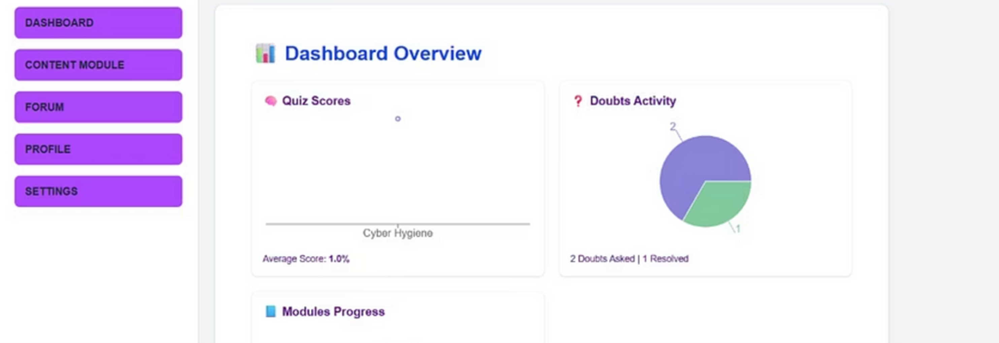

```markdown
# 🚀 CyberSafe: Cybersecurity Awareness Platform  

CyberSafe is a full-stack web application designed to **educate children, parents, and mentors about online safety**.  
Through interactive modules, progress tracking, and dedicated dashboards, CyberSafe empowers families to navigate the digital world securely.  


---

## 📖 Table of Contents  
- [✨ Features](#-features)  
- [🛠️ Tech Stack](#️-tech-stack)  
- [📂 Project Structure](#-project-structure)  
- [⚡ Getting Started](#-getting-started)  
  - [Frontend Setup](#frontend-setup)  
  - [Backend Setup](#backend-setup)  
- [▶️ Usage](#️-usage)  
- [📸 Screenshots](#-screenshots)  
- [🤝 Contributing](#-contributing)  
- [📜 License](#-license)  
- [👨‍💻 Author](#-author)  

---

## ✨ Features  

- 🎓 **Child Learning Modules** – Interactive, age-appropriate lessons on cyber safety.  
- 🧑‍🏫 **Mentor Dashboard** – Upload and manage educational content.  
- 👨‍👩‍👧 **Parent Dashboard** – Track child’s progress and monitor learning outcomes.  
- 📊 **Data Visualization** – Progress reports and insights using charts.  
- 📱 **Responsive Design** – Works seamlessly across devices.  
- ⚡ **Modern Web Stack** – Fast, scalable, and easy to maintain.  

---

## 🛠️ Tech Stack  

**Frontend:**  
- [Next.js](https://nextjs.org/) (App Router)  
- [React 18](https://react.dev/)  
- [Tailwind CSS](https://tailwindcss.com/)  
- [Recharts](https://recharts.org/) (for charts/visualizations)  

**Backend:**  
- Python (Flask/Django – depending on implementation in `/backend`)  
- REST APIs  

**Other Tools:**  
- Git & GitHub  
- CSV/Excel data integration  

---

## 📂 Project Structure  

```
```bash
CyberSafe/
├── backend/                      # Backend services (APIs, auth, data handling)
├── cyber-awareness-frontend/     # Next.js frontend
│   ├── app/                      # Application routes
│   │   ├── child/                # Child dashboard
│   │   ├── parent/               # Parent dashboard
│   │   ├── mentor/               # Mentor dashboard
│   │   ├── admin/                # Admin panel
│   │   └── page.js               # Landing page
│   ├── components/               # Reusable UI components
│   │   ├── Navbar.jsx
│   │   └── Footer.jsx
│   ├── public/                   # Static assets
│   ├── package.json
│   └── tailwind.config.js
├── requirements.txt              # Python dependencies
├── LICENSE
├── README.md
└── .gitignore
```
````

---

## ⚡ Getting Started  

### ✅ Prerequisites  
- [Node.js](https://nodejs.org/) v18+  
- [npm](https://www.npmjs.com/) v9+  
- [Python](https://www.python.org/) (for backend)  

---

### 🎨 Frontend Setup  

```bash
# Navigate to frontend
cd cyber-awareness-frontend

# Install dependencies
npm install

# Optional: install recharts if not included
npm install recharts

# Run development server
npm run dev
````

Frontend will be available at: **[http://localhost:3000](http://localhost:3000)**

---

### 🖥️ Backend Setup

```bash
# Navigate to backend
cd backend

# Install Python dependencies
pip install -r requirements.txt

# Run backend server (update with actual run command)
python app.py
```

Backend will be available at: **[http://localhost:5000](http://localhost:5000)** (example, update if different).

---

## ▶️ Usage

* **Child Login** → Access learning modules.
* **Parent Login** → Track child’s progress & reports.
* **Mentor Login** → Upload learning materials.
* **Admin Login** → Manage users and content.

---

## 📸 Screenshots

> *(Add screenshots here to showcase UI – login pages, dashboards, charts, etc.)*

Example:

```markdown


```

---

## 🤝 Contributing

Contributions are welcome! 🚀

1. Fork the repo
2. Create a feature branch:

   ```bash
   git checkout -b feature-name
   ```
3. Commit your changes:

   ```bash
   git commit -m "Add new feature"
   ```
4. Push and create a Pull Request

---

## 📜 License

This project is licensed under the **MIT License**.
See the [LICENSE](LICENSE) file for more details.

---

## 👨‍💻 Author

**Manoj Prathapa**
🔗 [GitHub Profile](https://github.com/ManojPrathapa)

Special thanks to the **team members** who contributed to this project. 🙌

---

⭐ If you found this project useful, consider giving it a **star** on GitHub! ⭐

```
