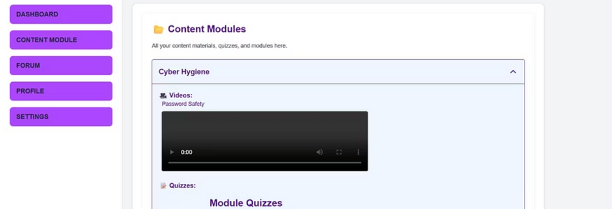
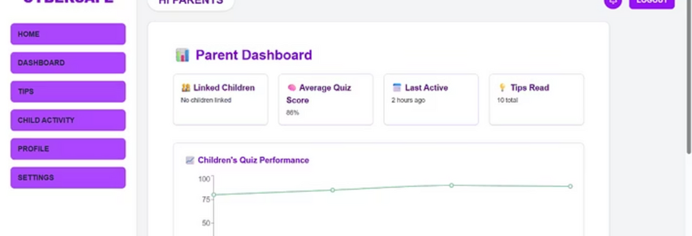
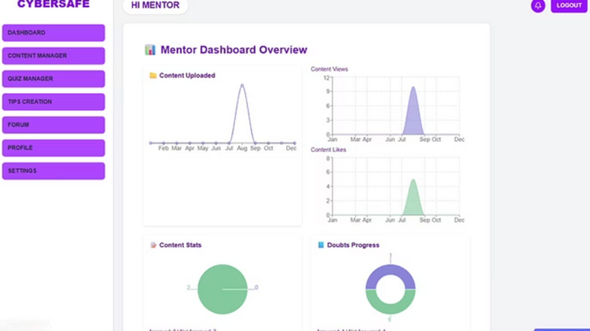
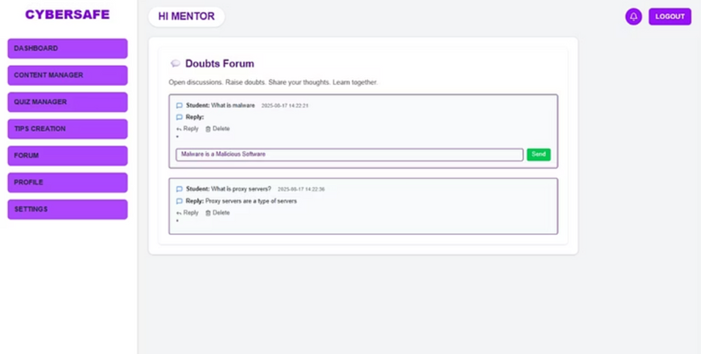
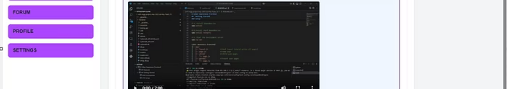
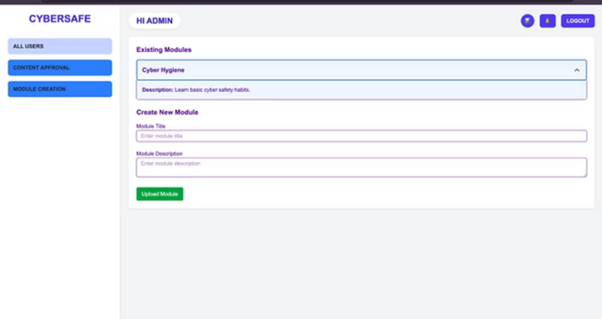

# 🚀 CyberSafe: Cybersecurity Awareness Platform  
CyberSafe is a **full-stack web application** built to **educate children, parents, and mentors** about safe online practices. With interactive modules, detailed dashboards, and intuitive interfaces, CyberSafe empowers families to **navigate the digital world with confidence**.


## 📚 Table of Contents  
- [✨ Features](#-features)  
- [🛠️ Tech Stack](#️-tech-stack)  
- [📂 Project Structure](#-project-structure)  
- [⚡ Getting Started](#-getting-started)  
  - [✅ Prerequisites](#-prerequisites)  
  - [🎨 Frontend Setup](#-frontend-setup)  
  - [🖥️ Backend Setup](#-backend-setup)  
- [▶️ Usage](#️-usage)  
- [📸 Screenshots](#-screenshots)  
- [🤝 Contributing](#-contributing)  
- [📜 License](#-license)  
- [👨‍💻 Author](#-author)  

---

## ✨ Key Features  

- 🎓 **Interactive Child Learning Modules**  
  A rich library of engaging, age-tailored lessons designed to instill cyber safety awareness in children.  
  Includes storytelling, scenario-based learning, and gamified quizzes that make complex cybersecurity concepts easy and fun to grasp.  

- 🧑‍🏫 **Comprehensive Mentor Dashboard**  
  Provides mentors with tools to upload, organize, and manage cybersecurity learning materials.  
  Features include structured content management, assignment of tasks to learners, and easy tracking of module completion rates.  

- 👨‍👩‍👧 **Insightful Parent Dashboard**  
  Parents can actively monitor their child’s learning journey with access to real-time progress reports, activity history, and detailed performance analytics.  
  Offers personalized recommendations for guiding children in safe digital practices.  

- 📊 **Smart Data Visualization & Analytics**  
  Displays performance and engagement through intuitive graphs, charts, and dashboards.  
  Transforms raw learning data into actionable insights that help parents and mentors identify strengths, weaknesses, and improvement opportunities.  

- 📱 **Seamless Responsive Design**  
  Built with a mobile-first approach, ensuring an optimized user experience across desktops, tablets, and smartphones.  
  Enables learning and monitoring on the go, without compromising accessibility or usability.  

- ⚙️ **Scalable Modular Architecture**  
  Designed with clean, modular components that make it easy to extend features, fix bugs, and scale the platform as user demand grows.  
  Ensures long-term maintainability, faster development cycles, and seamless integration with future enhancements.  

- 🔒 **Cybersecurity-Focused Content**  
  All learning materials are curated to address real-world cyber threats such as phishing, safe browsing, password hygiene, and digital well-being.  
  Content is regularly updated to keep pace with evolving cybersecurity risks and best practices.  

- 🌐 **Multi-Role Access Control**  
  Role-based access for children, parents, mentors, and admins ensures a secure and personalized experience for every type of user.  
  Each role has tailored features designed to meet their unique needs.  

- 🚀 **Future-Ready Platform**  
  Built with modern frameworks like **Next.js** and **React**, the platform supports rapid feature development, easy deployment, and integration with third-party tools (e.g., analytics, authentication, cloud hosting).  

---

## 🛠️ Tech Stack  

**Frontend**  
- [Next.js](https://nextjs.org/) (App Router)  
- [React 18](https://react.dev/)  
- [Tailwind CSS](https://tailwindcss.com/)  
- [Recharts](https://recharts.org/) (for charts)

**Backend**  
- Python (Flask or Django)  
- RESTful API design  

**Other Tools**  
- Git & GitHub  
- CSV/Excel integration  
- Responsive Design Tools  

---

## 📂 Project Structure  

```bash
CyberSafe/
├── backend/                      # Backend (Flask/Django APIs, auth, data logic)
├── cyber-awareness-frontend/    # Next.js frontend app
│   ├── app/
│   │   ├── child/                # Child dashboard
│   │   ├── parent/               # Parent dashboard
│   │   ├── mentor/               # Mentor dashboard
│   │   ├── admin/                # Admin panel
│   │   └── page.js               # Landing/Home page
│   ├── components/              # Reusable components (Navbar, Footer, etc.)
│   ├── public/                  # Static assets
│   ├── package.json
│   └── tailwind.config.js
├── requirements.txt              # Backend dependencies
├── LICENSE
├── README.md
└── .gitignore
````

---

## ⚡ Getting Started

### ✅ Prerequisites

Make sure the following are installed on your machine:

* [Node.js](https://nodejs.org/) v18+
* [npm](https://www.npmjs.com/) v9+
* [Python](https://www.python.org/) (for backend)
* Git

---

### 🎨 Frontend Setup

```bash
# Clone the repository
git clone https://github.com/ManojPrathapa/CyberSafe.git

# Navigate to frontend directory
cd CyberSafe/cyber-awareness-frontend

# Install dependencies
npm install

# Install Recharts (if not already included)
npm install recharts

# Start the development server
npm run dev
```

🌐 Visit `http://localhost:3000` to access the frontend.

---

### 🖥️ Backend Setup

```bash
# Navigate to the backend directory
cd CyberSafe/backend

# Install Python dependencies
pip install -r requirements.txt

# Start the backend server
python app.py  # or python manage.py runserver (if using Django)
```


---

## ▶️ Usage  

CyberSafe provides dedicated experiences for each type of user, ensuring tailored functionality and security.  

- 👶 **Child Login**  
  Grants children access to **fun, interactive, and age-appropriate learning modules** designed to teach cyber safety in an engaging way.  
  Includes quizzes, stories, and gamified activities to make learning memorable.  

- 👨‍👩‍👧 **Parent Login**  
  Empowers parents to **track their child’s progress, view analytics, and monitor online safety habits**.  
  Provides actionable insights, personalized recommendations, and historical data to guide children towards responsible digital behavior.  

- 🧑‍🏫 **Mentor Login**  
  Offers mentors a **centralized dashboard to upload, organize, and manage educational materials**.  
  Enables mentors to assign learning tasks, review completion rates, and measure overall impact on students’ digital literacy.  

- 🛠️ **Admin Panel**  
  Provides administrators with **full control over the platform**, including user management, module creation, and content moderation.  
  Ensures smooth operation, scalability, and data integrity across all user roles.  

---
## 📸 Screenshots  

Below are sample views of the **CyberSafe Platform**, organized by user role.  

---

### 👶 Child Interface  

| Dashboard                                   | Content Module Page                             |
| ------------------------------------------- | ----------------------------------------------- |
|  |  |

| Quizzes Page                                |
| ------------------------------------------- |
|    |

---

### 👨‍👩‍👧 Parent Interface  

| Parent Dashboard                            | Activity Tracker Page                           |
| ------------------------------------------- | ----------------------------------------------- |
|  |  |

---

### 🧑‍🏫 Mentor / Trainer Interface  

| Mentor Dashboard                            | Quiz Creation Page                              |
| ------------------------------------------- | ----------------------------------------------- |
|  |  |

| Forum Page                                  | Video/Module Upload Page                        |
| ------------------------------------------- | ----------------------------------------------- |
|       |  |

---

### 🛠️ Admin Interface  

| User Tracker Page                           | Content Approval Page                           |
| ------------------------------------------- | ----------------------------------------------- |
|  |  |

---

> 📂 Place all screenshots in the `/screenshots` directory with filenames matching the references above.  
> For example: `screenshots/child-dashboard.png`, `screenshots/mentor-forum.png`, etc.  

---


### 🧩 Steps to Contribute:

1. **Fork** this repository
2. **Clone** your forked repo
3. Create a new branch

   ```bash
   git checkout -b feature/your-feature-name
   ```
4. Commit your changes

   ```bash
   git commit -m "✨ Added new feature"
   ```
5. Push to your fork

   ```bash
   git push origin feature/your-feature-name
   ```
6. Create a **Pull Request** and describe your changes

> Please follow the project's code style and naming conventions.

---

## 📜 License

This project is licensed under the **MIT License**.
See the [LICENSE](./LICENSE) file for details.

---

## 👨‍💻 Author

**Manoj Prathapa**
🔗 [GitHub](https://github.com/ManojPrathapa)
🌟 *Special thanks to the amazing team and contributors who helped bring CyberSafe to life!*

---

<div align="center">

⭐️ *If you find this project helpful, give it a star on GitHub!* ⭐️

</div>
```
